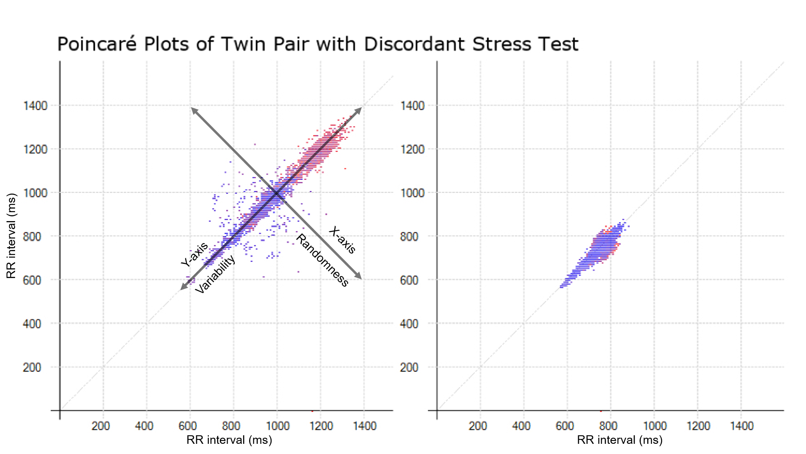
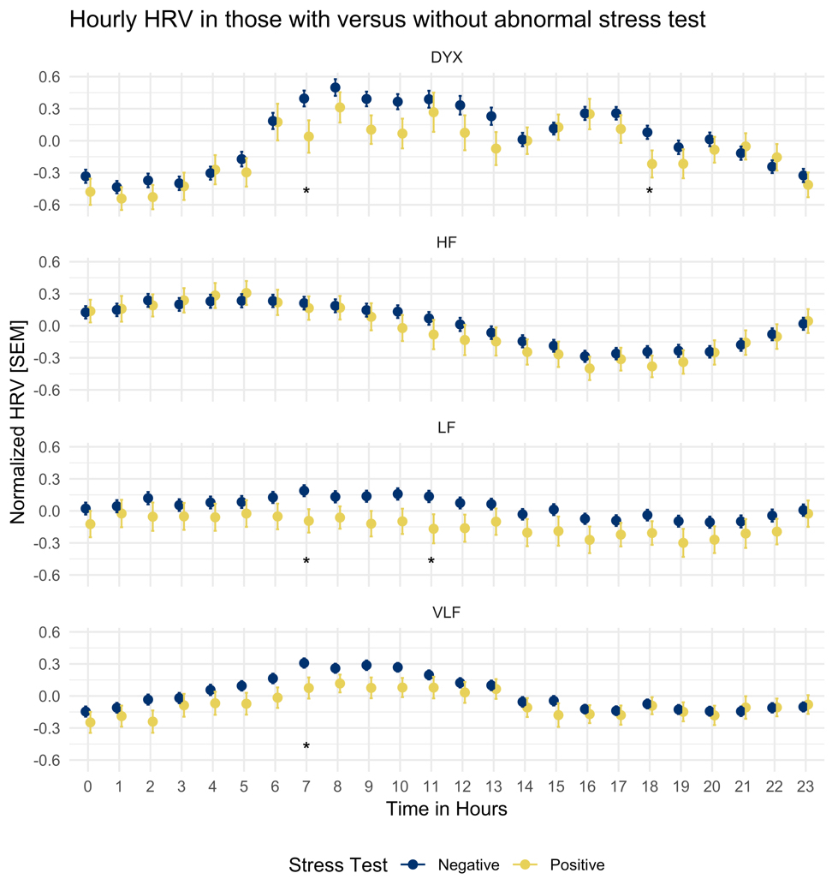

```{r global_options, include=FALSE}

# Knitr options
knitr::opts_chunk$set(
  cache = TRUE,
  warning = FALSE,
  eval = TRUE,
  echo = FALSE,
  include = TRUE,
  message = FALSE,
  dpi = 600,
  dev = "png",
  options("scipen" = 999, "digits" = 3),
  tinytex.verbose = TRUE,
  tidy = FALSE
)

options(xtable.comment = FALSE)
```

```{r load up data, include = FALSE}
# Start time
alpha_time <- Sys.time()

# Libraries
source("1_libraries.R")

# Read in the files
source("2a_vivalnk.R")
source("2b_hrv.R")
source("2c_biobank.R")

# Source Tidying
source("3_tidy.R")

# End of process
omega_time <- Sys.time()
cat("Time to load libraries, intake data, and tidy it...")
print(omega_time - alpha_time)
```

# Overview
### Aims

1. Quantify how depression affects ANS function
2. Examine how ANS dysfunction can predict obstructive (versus microvascular) CAD

### Background {.allowframebreaks}

This is a pilot study examining the relationship between depression and CAD. We have shown using the non-linear HRV metric, Dyx, is a powerful predictor of CAD, and can also be a useful marker for Depression.



### Emory Cardiovascular Biobank

- Ongoing prospective cohort of patients undergoing cardiac catherization
- Includes clinical history and biomarkers
- Includes psychological questionnaires (including depression by PHQ9)
- Over 7000 patients enrolled overall
- Have enrolled 36 patients thus far

# Description

## Population

### Demographic description

```{r demographics, results = "asis"}
df <- demo
df$adm_reason <- df_txt$adm_reason
df$gend <- df_txt$gend
df$race <- df_txt$race
df$setting <- df_txt$setting

# Table 1
compareGroups(~ gend + race + blbmi + setting + age, data = df) %>%
  createTable(., hide = c(gend = "Female"), show.p.overall = FALSE) %>%
  export2md(., format = "latex", size = 8, caption = "Population")
```

## Depression

### Depression scoring

- Each patient is given a questionnaire, the PHQ9
- The scores are validated and suggest severity/category of depression
- Scores >= 10 are considered moderate to severe depression, and accepted cut-off

### Depression table

```{r depression scoring}
df <- inner_join(demo, psych, by = "patid")
df$adm_reason <- df_txt$adm_reason
df$gend <- df_txt$gend
df$race <- df_txt$race
df$sad %<>% factor()
levels(df$sad) <- c("Low Depression", "High Depression")

# Depression comparison
compareGroups(data = df, sad ~ gend + race + adm_reason) %>%
  createTable(., hide = c(gend = "Female"), show.p.overall = FALSE) %>%
  export2md(., format = "latex", size = 8, caption = "Depression scoring")
```

## Coronary artery disease

### Cardiac catherization

- Every patient presents for cardiac catherization to be enrolled
- Are either inpatient or outpatient
- Etiology: pre-op, heart transplant, UA, NSTEMI, STEMI, positive stress test
- scored by angiographic severity indices - CASS and Gensini scores

### CAD Severity

```{r CAD overview}
df <- inner_join(demo, angio_scores, by = "patid")
df$adm_reason <- df_txt$adm_reason
df$gend <- df_txt$gend
df$race <- df_txt$race
df$cad <- ifelse(df$cass70 >= 1, 1, 0)

# CAD scoring systems
compareGroups(data = df, ~ cass50 + cass70 + gensini + stenosis) %>%
  createTable(., show.p.overall = FALSE) %>%
  export2md(., format = "latex", size = 8, caption = "CAD Severity Scores")
```

## Heart rate variability

### Overview of HRV

- ECG data was collected using the VivaLNK patch
- this records data for up to 72 hours
- ECG was started the AM of LHC, and continued for several hours after event
- HRV is generated through the Emory HRV Toolbox 
- Frequency domain was log-transformed
- HRV was blocked into averaged 1-hour segments for analysis
- Approximately 25% of the HRV data was considered unusuable and discarded

### Quality of HRV data

```{r}
df <- hrv_params

# HRV quality
compareGroups(data = df, ~ Duration + PercentNotAnalyzed + PercentLowQualityWind) %>%
  createTable(., show.p.overall = FALSE) %>%
  export2md(., format = "latex", size = 8, caption = "HRV quality")
```

### Overview of HRV measures {.allowframebreaks}

```{r, HRV graphs}
df <- hrv_long
month(df$clock) <- month(today())
day(df$clock) <- day(today())

# Visualize
ggplot(df, aes(x = clock, y = value, color = hrv)) +
  geom_smooth(se = TRUE) +
  scale_x_datetime(date_breaks = "4 hours", date_labels = "%H") +
  facet_wrap(~hrv, scales = "free_y") +
  scale_color_viridis_d() +
  theme_minimal() +
  theme(
    legend.position = "none"
  ) +
  labs(
    title = "HRV",
    x = "Time (hour of day)",
    y = "HRV"
  )


# Visualizing all the data will be expensive
# Even reducing to just a few patients may be exhaustingly slow
gTimeHRV <-
  ggplot(df, aes(x = clock, y = values)) +
  facet_wrap(~ hrv, ncol = 2) +
  stat_summary(aes(group = hrv, y = values), fun.data = "mean_cl_normal", geom = "ribbon", alpha = 1 / 5) +
  stat_summary(aes(group = hrv, colour = hrv, y = values), fun.y = mean, geom = "line") +
  labs(
    title = "Heart Rate Variability over 24-hours",
    x = "Time of Day (hours)",
    y = "Mean and standard error of the mean",
    colour = "HRV measures"
  ) +
  scale_colour_viridis_d() + 
  theme_minimal() + 
  theme(
    legend.position = "none"
  ) 
```

```{r, individual tachogram, include = FALSE}
df <- subset(hrv_proc, patid %in% c("06978", "07052"))
df$hour <- hour(df$clock)
df$BPM <- round(df$BPM)
df$patid <- factor(df$patid)

# Generate tachogram
# Xaxis is hour of day
# Yaxis is heart rate 
ggplot(na.omit(df), aes(x = factor(hour), y = BPM, fill = factor(hour))) +
  facet_wrap(~patid, nrow = 2, scales = "free_y") +
  geom_boxplot() + 
  theme(legend.position = "none") +
  scale_fill_viridis_d() +
  theme_minimal() +
  theme(legend.position = "none") +
  labs(
    x = "Time of Day (hours)",
    y = "Heart Rate (beats per minute)"
  )

```

# Aim 1: Relationship between Depression and ANS Dysfunction

### Differences in population
        
```{r basic stats for depression}
df <- inner_join(psych[c("patid", "sad", "phq")], hrv_first_hour, by = "patid")

# Comparison of "best" HRV measures
compareGroups(data = df, sad ~ HF + LF + VLF + AC + DC + DYX + NN) %>%
  createTable(.) %>%
  export2md(., format = "latex", size = 8, caption = "HRV by Depressive Sx Burden")
```

### Hourly differences

- We expect to study the circadian differences in depression and HRV
- awaiting more complete data sets to perform cosinor analysis

```{r circadian depression and T-test}
# Df for visualization
df <-
  hrv_blocks %>%
  pivot_longer(., names_to = "hrv", values_to = "value", -c(patid, hour)) %>%
  inner_join(psych[c("patid", "sad")], ., by = "patid") %>%
  na.omit() %>%
  group_by(sad, hour, hrv) %>%
  dplyr::summarise(mean = mean(value), n = length(value), sd = sd(value), se = sd(value) / sqrt(length(value)))

# Have P values for significant differences handy (not currently working)
#overall_t <-
#  inner_join(subset(psych, !is.na(sad)), hrv_blocks, by = "patid") %>%
#  na.omit() %>%
#  do(
#    NN = t.test(NN ~ sad, data = .)$p.value,
#    SDNN = t.test(SDNN ~ sad, data = .)$p.value,
#    RMSSD = t.test(RMSSD ~ sad, data = .)$p.value,
#    PNN50 = t.test(PNN50 ~ sad, data = .)$p.value,
#    ULF = t.test(ULF ~ sad, data = .)$p.value,
#    VLF = t.test(VLF ~ sad, data = .)$p.value,
#    LF = t.test(LF ~ sad, data = .)$p.value,
#    HF = t.test(HF ~ sad, data = .)$p.value,
#    LFHF = t.test(LFHF ~ sad, data = .)$p.value,
#    TP = t.test(TP ~ sad, data = .)$p.value,
#    AC = t.test(AC ~ sad, data = .)$p.value,
#    DC = t.test(DC ~ sad, data = .)$p.value,
#    SampEn = t.test(SampEn ~ sad, data = .)$p.value,
#    ApEn = t.test(ApEn ~ sad, data = .)$p.value,
#  )
#  gather(variable, value, -hour)
#hourly_t$value <- as.numeric(hourly_t$value)
#
## Visualization of data faceted by HRV and grouped by ischemia
#gCircadianSadness <-
#  ggplot(df, aes(x = factor(hour), colour = sad)) +
#  facet_wrap(~ hrv, scales = "free_y") +
#  geom_point(aes(y = mean), size = 2, position = position_dodge(.3)) +
#  scale_shape_manual(values = c(1, 16)) +
#  geom_errorbar(aes(ymin = mean - se, ymax = mean + se), width = 0.2, position = position_dodge(.3))
#  theme(panel.border = element_rect(colour = "black", fill = NA)) +
#  labs(
#    title = "Hourly HRV in those with depression",
#    x = "Time in Hours",
#    y = "Normalized HRV [SEM]",
#    colour = "Depression",
#  ) +
#  scale_color_viridis(option = "cividis", discrete = TRUE, begin = .1, end = .9) +
#  theme_minimal() +
#  theme(
#    plot.caption = element_text(hjust = 0),
#    legend.position = "bottom",
#    legend.box = "horizontal"
#  )
```

### Visualizing Differences in HRV by Depression

```{r HRV x depression plot}
df <- 
  inner_join(hrv_proc, psych[c("patid", "sad")], by = "patid") %>%
  pivot_longer(., names_to = "hrv", values_to = "value", values_drop_na = TRUE, -c(patid, index, clock, sad)) %>%
  na.omit() 

month(df$clock) <- month(today())
day(df$clock) <- day(today())

# Visualize (can't visualize right now, there are issues)
ggplot(df, aes(x = clock, y = value, group = factor(sad), color = factor(sad))) + 
  geom_smooth(na.rm = TRUE) +
  scale_x_datetime(date_breaks = "4 hours", date_labels = "%H") +
  facet_wrap(~hrv, scales = "free_y") +
  scale_color_viridis_d(option = "E") +
  theme_minimal() +
  theme(legend.position = "none") + 
  labs(
    title = "HRV by Depression (sad = yellow)",
    x = "Time (hour of day)",
    y = "HRV"
  )
```

### Measures of association {.allowframebreaks}

```{r}
df <- 
  pivot_longer(hrv_first_hour, names_to = "hrv", values_to = "value", -c(patid, hour, index, clock)) %>%
  inner_join(psych, ., by = "patid")

# Visualize "first hour" data
ggplot(df, aes(x = phq, y = value, color = hrv)) +
  geom_point() +
  geom_smooth(method = "lm") +
  facet_wrap(~hrv, scales = "free_y") +
  theme_minimal() +
  theme(legend.position = "none") +
  labs(
    title = "First hour of HRV (before cath) and depression",
    x = "PHQ score",
    y = "HRV"
  )
```


```{r basic regressions, include = FALSE}
# Basic regressions
df <- inner_join(hrv_first_hour, psych, by = "patid") %>%
  inner_join(demo, ., by = "patid")

# Models that are close to significant are given names
mhf <- glm(sad ~ HF + gend + age, family = "binomial",  data = df)
mlf <- glm(sad ~ LF + gend + age, family = "binomial",  data = df) 
mvlf <- glm(sad ~ VLF + gend + age, family = "binomial",  data = df) 

glm(sad ~ LFHF + gend + age, family = "binomial",  data = df) %>% summary()

glm(sad ~ ApEn + gend + age, family = "binomial",  data = df) %>% summary()

msampen <- glm(sad ~ SampEn + gend + age, family = "binomial",  data = df) 

glm(sad ~ AC + gend + age, family = "binomial",  data = df) %>% summary()

glm(sad ~ DC + gend + age, family = "binomial",  data = df) %>% summary()

glm(sad ~ DYX + gend + age, family = "binomial",  data = df) %>% summary()
```

```{r, display models, results = 'asis'}
stargazer(mhf, mlf, mvlf, msampen, type = "latex", header = F,
          digits = 3, font.size = "tiny",  no.space = T,
          title = "First hour of HRV and depression",
          ci = TRUE
          )
```

# Aim 2: Relationship between CAD and ANS Dysfunction

### Differences in population

```{r basic stats for CAD}
df <- inner_join(angio_scores, hrv_first_hour, by = "patid")
df$cad1 <- ifelse(df$cass50 >= 1, 1, 0)
df$cad2 <- ifelse(df$cass50 >= 2, 1, 0)
df$cad3 <- ifelse(df$cass50 >= 3, 1, 0)
df$cad4 <- ifelse(df$cass70 >= 1, 1, 0)
df$cad5 <- ifelse(df$cass70 >= 2, 1, 0)
df$cad6 <- ifelse(df$cass70 >= 3, 1, 0)

# Comparison of "best" HRV measures at first hour
# Candidate measures = RMSSD, PNN50, AC .... ULF, LFHF, DC, SDNN
# Cass50 = ...
# Cass70 > 1 =  AC, DC, SampEn
df %>%
  compareGroups(data = ., cad4 ~ LFHF + NN + SDNN + RMSSD + PNN50 + AC + DC + SampEn + ApEn + DYX) %>%
  createTable(.) %>%
  export2md(., format = "latex", size = 8, caption = "HRV by Obstructive CAD")

# At 10 AM... >70% CAD = HF, TP, SDNN, RMSSD, PNN50, AC, DC, ApEn
```

### Visualizing Differences in HRV by CAD

```{r HRV x CAD plot}
df <- inner_join(hrv_proc, angio_scores[c("patid", "stenosis", "cass70")], by = "patid")
df$cad <- ifelse(df$cass70 > 1, 1, 0)

df %<>%
  pivot_longer(., names_to = "hrv", values_to = "value", values_drop_na = TRUE, -c(patid, index, clock, stenosis, cad, cass70)) %>% 
  na.omit()

month(df$clock) <- month(today())
day(df$clock) <- day(today())

# Visualize
ggplot(df, aes(x = clock, y = value, group = factor(cad), color = factor(cad))) + 
  geom_smooth(na.rm = TRUE) +
  scale_x_datetime(date_breaks = "4 hours", date_labels = "%H") +
  facet_wrap(~hrv, scales = "free_y") +
  scale_color_viridis_d(option = "E") +
  theme_minimal() +
  theme(legend.position = "none") + 
  labs(
    title = "HRV by CASS70 (if >1 = yellow)",
    x = "Time (hour of day)",
    y = "HRV"
  )
```

### Hourly differences {.allowframebreaks}

- We expect time-of-day to be an important factor based on prior research
- Early morning increase in sympathetic outflow "mimics" that of increased stress to identify at risk patients



```{r, circadian CAD, include = FALSE}
# Df for visualization
tmp <- angio_scores
tmp$cad <- ifelse(tmp$cass50 > 1, 1, 0)

df <- 
  hrv_blocks %>%
  pivot_longer(., names_to = "hrv", values_to = "value", -c(patid, hour)) %>%
  inner_join(tmp[c("patid", "cad")], ., by = "patid") %>%
  na.omit() %>%
  group_by(hour, hrv, cad) %>%
  dplyr::summarise(mean = mean(value), n = length(value), sd = sd(value), se = sd(value) / sqrt(length(value)))


df <- 
  inner_join(tmp, hrv_blocks, by = "patid") %>%
  na.omit() %>%
  group_by(hour) %>%
  do(
    NN = tidy(t.test(NN ~ cad, data = .)),
    SDNN = tidy(t.test(SDNN ~ cad, data = .)),
    RMSSD = tidy(t.test(RMSSD ~ cad, data = .)),
    PNN50 = tidy(t.test(PNN50 ~ cad, data = .)),
    ULF = tidy(t.test(ULF ~ cad, data = .)),
#    VLF = tidy(t.test(VLF ~ cad, data = .)),
#    LF = tidy(t.test(LF ~ cad, data = .)),
#    HF = tidy(t.test(HF ~ cad, data = .)),
    LFHF = tidy(t.test(LFHF ~ cad, data = .)),
#    TP = tidy(t.test(TP ~ cad, data = .)),
    AC = tidy(t.test(AC ~ cad, data = .)),
    DC = tidy(t.test(DC ~ cad, data = .)),
    SampEn = tidy(t.test(SampEn ~ cad, data = .)),
    ApEn = tidy(t.test(ApEn ~ cad, data = .)),
    DYX = tidy(t.test(DYX ~ cad, data = .))
    )

# Visualization of data faceted by HRV and grouped by ischemia
tmp <-
  ggplot(df, aes(x = factor(hour), colour = stenosis)) +
  facet_wrap(~ hrv, scales = "free_y") +
  geom_point(aes(y = mean), size = 2, position = position_dodge(.3)) +
  scale_shape_manual(values = c(1, 16)) +
  geom_errorbar(aes(ymin = mean - se, ymax = mean + se), width = 0.2, position = position_dodge(.3)) +
  theme(panel.border = element_rect(colour = "black", fill = NA)) +
  labs(
    title = "Hourly HRV in those with CAD",
    x = "Time in Hours",
    y = "Normalized HRV [SEM]",
    colour = "CAD"
  ) +
  scale_color_viridis(option = "cividis", discrete = TRUE, begin = .1, end = .9) +
  theme_minimal()
```

### Measuring association {.allowframebreaks}

```{r}
df <- 
  pivot_longer(hrv_first_hour, names_to = "hrv", values_to = "value", -c(patid, index, index, clock, hour)) %>%
  inner_join(angio_scores, ., by = "patid") %>%
  na.omit()
df$cad <- ifelse(df$cass70 >= 1, 1, 0)

# Visualize "first hour" data
ggplot(df, aes(x = value, y = cad, color = hrv)) +
  geom_point() +
  geom_smooth(method = "glm", method.args = list(family = "binomial")) +
  facet_wrap(~hrv, scales = "free_x") +
  theme_minimal() +
  theme(legend.position = "none") +
  labs(
    title = "Does HRV Classify patients with CAD?",
    x = "HRV",
    y = "CAD"
  )
```

```{r basic regressions for cad, include = FALSE}
# Basic regressions
df <- inner_join(hrv_first_hour, angio_scores, by = "patid") %>%
  inner_join(demo, ., by = "patid")
df$cad <- ifelse(df$cass70 >= 1, 1, 0)

glm(cad ~ HF + gend + age, family = "binomial",  data = df) %>% summary()
glm(cad ~ LF + gend + age, family = "binomial",  data = df) %>% summary()
glm(cad ~ VLF + gend + age, family = "binomial",  data = df) %>% summary()
glm(cad ~ LFHF + gend + age, family = "binomial",  data = df) %>% summary()
glm(cad ~ ApEn + gend + age, family = "binomial",  data = df) %>% summary()
glm(cad ~ SampEn + gend + age, family = "binomial",  data = df) %>% summary()
glm(cad ~ AC + gend + age, family = "binomial",  data = df) %>% summary()
glm(cad ~ DC + gend + age, family = "binomial",  data = df) %>% summary()
glm(cad ~ DYX + gend + age, family = "binomial",  data = df) %>% summary()
```

### DYX exploration

```{r, include = FALSE}
df <- inner_join(angio_scores, hrv_blocks, by = "patid")
df$cad <- ifelse(df$cass70 >= 1, 1, 0)


ggplot(na.omit(df), aes(x = hour, y = DYX, group = factor(cad), colour = factor(cad))) +
  geom_smooth()

ggplot(na.omit(df), aes(x = hour, y = ApEn, group = factor(cad), colour = factor(cad))) +
  geom_smooth()

ggplot(na.omit(df), aes(x = hour, y = AC, group = factor(cad), colour = factor(cad))) +
  geom_smooth()

ggplot(na.omit(df), aes(x = hour, y = DC, group = factor(cad), colour = factor(cad))) +
  geom_smooth()

mdyx <- glm(cad ~ DYX*hour, family = "binomial", data = df)
```

```{r, t test}
t.test(DYX ~ cad, data = subset(df, hour == 11))
```

# Future Directions and Limitations

- Larger sample size
- Identify times of catherization to control for sedation
- Consider stratifying effects of medications (e.g. beta blockers)
- Subset of patients with first-time angina (versus known CAD)
- Cosinor/complex time series analyses
- Circadian / time-of-day adjustment
- Adjustment for risk factors